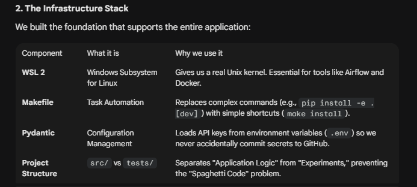
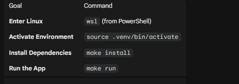
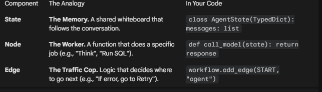
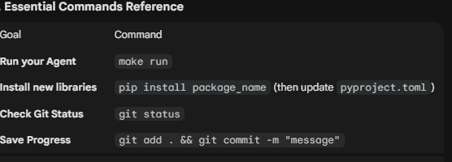

📝 Day 1 Review: The Senior Environment:

1. The Core Concept: Production vs. Playground
On Day 1, we rejected the "Data Science Notebook" approach (flat files, hardcoded keys) in favor of a "Production Engineering" setup.

The Old Way: Coding on Windows/PowerShell, installing libraries globally, dragging and dropping files.

The Senior Way: Coding in Linux (WSL), isolating dependencies (venv), and automating tasks (Makefile).

3. Key Technical Wins
    - Environment Isolation: Created a Python virtual environment(.venv) to ensure dependicies don't conflict with other projects
    - Secure Auth: Configured src/core/config.py to authenicate with AWS Bedrock without exposing credentials
    - Proof of Life: Successfully sent a playload to Claude 3.5 Sonnet and received a response, proving the network pipeline is actice

4. Essential Commands Reference

📝 Day 2 Review: The Agentic Brain:

1. The Core Concept: Chains vs. Graphs:
    - The Old Way (Chains): A straight line (Start -> A -> B -> End). If Step B fails, the program crashes. 

    - The New Way (Graphs): A loop (Start -> Node A ⇆ Node B -> End). If Node B fails, it can cycle back to Node A to try again.

2. The Three Pullars of LangGraph:
    To build any autonomous agent, you only need three blocks:

    

3. Code Breakdown:

    1. builder = StateGraph(AgentState)
        - Translation: "I am building a robot. Its brain structure is defined by AgentState"
    2. builder.add_node("agent", call_model)
        - Translation: "The robot has one skill called 'agent'. When I ask it to do that skill, it runs the call_model functions"
    3. builder.add_edge(START, "agent")
        - Translation: "When I turn the robot on, the first this it should do is the 'agent' skill"
    4. app = builder.compile()
        - Translation: "Build the robot and get it ready to work."

4. Polish: Added a System Prompt ("You are a Senior Data Analyst...")

    - Why? LLMs are "prediction engines", not "truth engines." Without a persona, they default to being helpful creative writers. By forcing the persona, you constrain the "Latent Space" to professional, factual answers. This is critical for SQL generation.

5. 